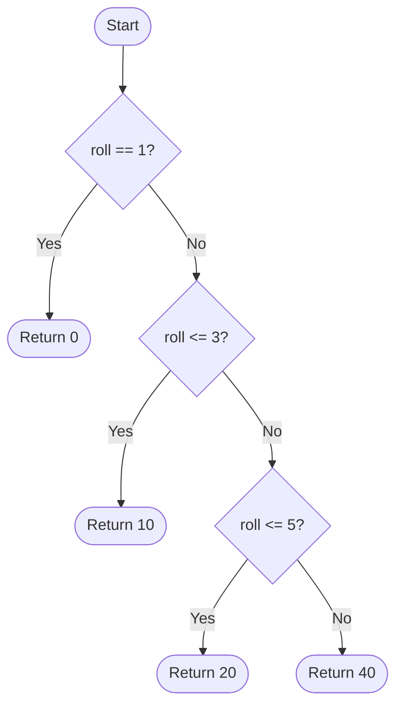

# hunt_food

`hunt_food(roll: u64) -> u64`

```mermaid
flowchart TD
    A([Start]) --> B{roll == 1?}
    B -- Yes --> R0([Return 0])
    B -- No --> C{roll <= 3?}
    C -- Yes --> R1([Return 10])
    C -- No --> D{roll <= 5?}
    D -- Yes --> R2([Return 20])
    D -- No --> R3([Return 40])
```
