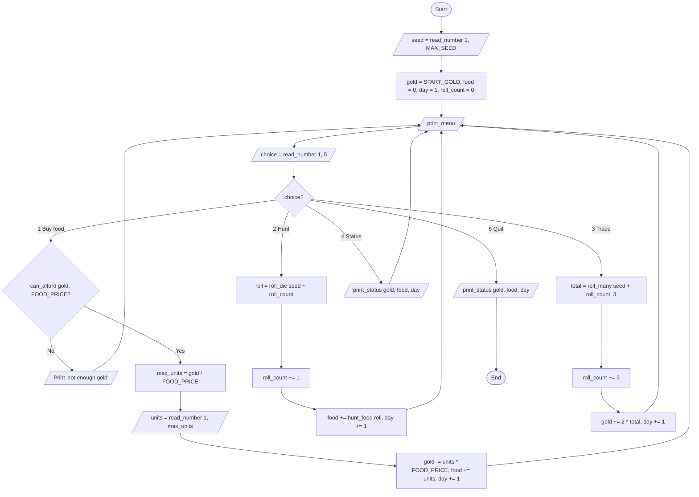

# main

`main()`

```mermaid
flowchart TD
    A([Start]) --> B[/seed = read_number 1, MAX_SEED/]
    B --> C[gold = START_GOLD, food = 0, day = 1, roll_count = 0]
    C --> D[/print_menu/]
    D --> E[/choice = read_number 1, 5/]
    E --> F{choice?}

    F -- 1 Buy food --> G{can_afford gold, FOOD_PRICE?}
    G -- No --> G1[/Print 'not enough gold'/]
    G1 --> D
    G -- Yes --> G2[max_units = gold / FOOD_PRICE]
    G2 --> G3[/units = read_number 1, max_units/]
    G3 --> G4[gold -= units * FOOD_PRICE, food += units, day += 1]
    G4 --> D

    F -- 2 Hunt --> H[roll = roll_die seed + roll_count]
    H --> H1[roll_count += 1]
    H1 --> H2[food += hunt_food roll, day += 1]
    H2 --> D

    F -- 3 Trade --> T[total = roll_many seed + roll_count, 3]
    T --> T1[roll_count += 3]
    T1 --> T2[gold += 2 * total, day += 1]
    T2 --> D

    F -- 4 Status --> S[/print_status gold, food, day/]
    S --> D

    F -- 5 Quit --> Q[/print_status gold, food, day/]
    Q --> Z([End])
```
