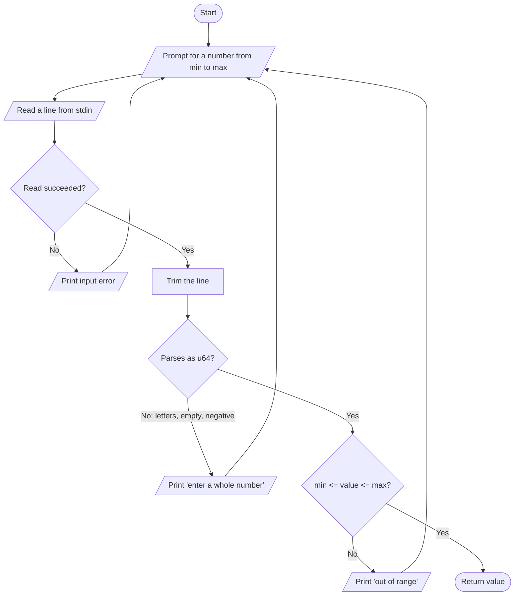

# read_number

`read_number(min: u64, max: u64) -> u64`

```mermaid
flowchart TD
    A([Start]) --> B[/Prompt for a number from min to max/]
    B --> C[/Read a line from stdin/]
    C --> D{Read succeeded?}
    D -- No --> E[/Print input error/]
    E --> B
    D -- Yes --> F[Trim the line]
    F --> G{Parses as u64?}
    G -- No: letters, empty, negative --> H[/Print 'enter a whole number'/]
    H --> B
    G -- Yes --> I{min <= value <= max?}
    I -- No --> J[/Print 'out of range'/]
    J --> B
    I -- Yes --> K([Return value])
```
