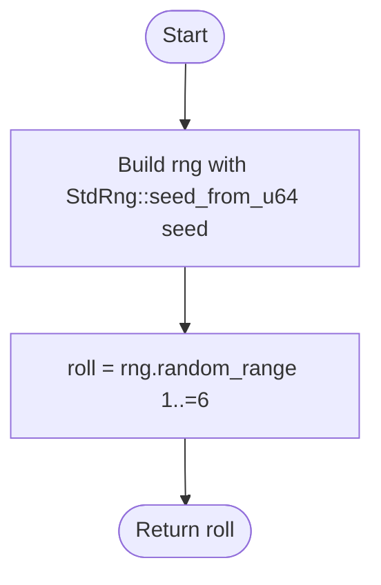

# roll_die

`roll_die(seed: u64) -> u64`

```mermaid
flowchart TD
    A([Start]) --> B[Build rng with StdRng::seed_from_u64 seed]
    B --> C[roll = rng.random_range 1..=6]
    C --> D([Return roll])
```
